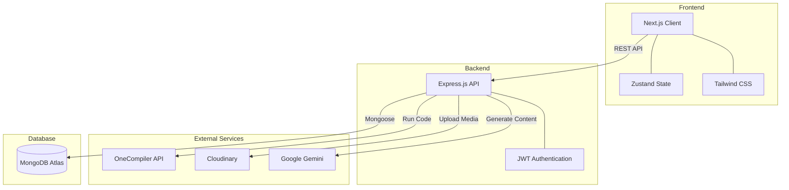

<div align="center">
  <h1>CodeLoom 🚀</h1>
  <p><strong>Next-Generation AI-Powered Learning Platform</strong></p>
  
  
  
  
  
  
</div>

<br />

## 🌟 Overview

**CodeLoom** is a premium, full-stack educational platform designed to provide an immersive and interactive coding experience. Built with a highly sophisticated neo-glassmorphism aesthetic, CodeLoom seamlessly merges comprehensive course management, live code execution, and AI-powered learning assistance.

## ✨ Key Features

- 🎨 **Neo-Glassmorphism UI**: A visually stunning, highly responsive design system with vibrant neon gradients and modern typography.
- 🧑‍🏫 **Role-Based Workflows**: Dedicated dashboards and capabilities for Students, Instructors, and Administrators.
- 💻 **Live Code Execution**: Embedded Monaco Editor with support for compiling and running Python, JavaScript, Java, and C++ directly in the browser via the OneCompiler API.
- 🧠 **AI Integration**: Powered by Google Gemini to assist students with code explanations and help instructors instantly generate quizzes.
- 🏆 **Gamification & Progress**: Real-time leaderboards, dynamic XP tracking, streaks, and verifiable completion certificates.

---

## 🏗️ Architecture

CodeLoom follows a robust Client-Server architecture utilizing the MERN stack (augmented with Next.js). 



---

## 🛠️ Tech Stack

### Client (Frontend)
- **Framework**: Next.js 14 (App Router)
- **Styling**: Tailwind CSS, class-variance-authority, clsx
- **State Management**: Zustand
- **Components**: Radix UI primitives, Lucide Icons
- **Code Editor**: `@monaco-editor/react`

### Server (Backend)
- **Runtime**: Node.js
- **Framework**: Express.js
- **Database**: MongoDB (Mongoose ORM)
- **Authentication**: JWT & bcryptjs
- **Services**: Cloudinary (Media), Google Gemini (AI)

---

## 🚀 Getting Started

### Prerequisites
- Node.js (v18+)
- MongoDB connection string
- API Keys for Gemini, Cloudinary, and OneCompiler

### Installation

1. **Clone the repository**
   ```bash
   git clone https://github.com/BAJI-761/CODE-LOAM.git
   cd CODE-LOAM
   ```

2. **Setup the Backend**
   ```bash
   cd server
   npm install
   # Create a .env file based on the provided credentials
   npm run dev
   ```

3. **Setup the Frontend**
   ```bash
   cd ../client
   npm install
   # Create a .env.local file with NEXT_PUBLIC_API_URL=http://localhost:5000/api/v1
   npm run dev
   ```

4. **Access the application**
   Navigate to `http://localhost:3000` in your browser.

---

## 📈 Development History & Bulk Seeding

To demonstrate the platform's full capability, CodeLoom includes an advanced seeder script that automates the generation of:
- **10+ Instructors & Students** with generated AI avatars.
- **20+ Courses** populated with modules, quizzes, and custom AI-generated banner art.
- **Hundreds of submissions and enrollments** to ensure Leaderboards, Analytics, and Dashboards are fully populated upon initialization.

Run the seeder with:
```bash
cd server
npm run seed:all
```
